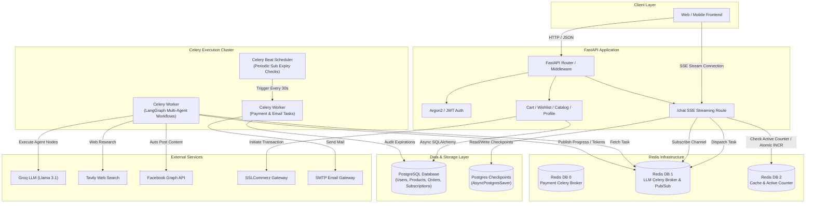

# 🚀 Enterprise E-Commerce & Autonomous Agentic AI Platform (Backend)

[](https://fastapi.tiangolo.com/)
[](https://www.python.org/)
[](https://www.postgresql.org/)
[](https://redis.io/)
[](https://docs.celeryq.dev/)
[](https://www.langchain.com/langgraph)
[](https://sslcommerz.com/)

An enterprise-grade, asynchronous micro-architecture backend built with **FastAPI**, **Celery**, **Redis**, **PostgreSQL**, and **LangGraph**. Designed to power high-concurrency e-commerce operations, real-time Server-Sent Events (SSE) streaming, automated payment subscription lifecycles, and autonomous multi-agent AI workflows.

---

## 📌 Executive Summary

This project showcases an advanced backend infrastructure engineered for scalability, real-time responsiveness, and background execution. It seamlessly integrates traditional e-commerce features (Auth, Cart, Wishlist, Products, Local Search) with modern **Agentic AI capabilities** (Automated Social Media Post & Reel Generation, Product Search Agents) and a **robust background job manager** powered by Celery & Redis.

---

## ✨ Key Architectural Highlights

### ⚡ 1. Distributed Task Management (Celery Workers & Celery Beat Scheduler)
- **Dual Celery Applications**: Separated into isolated execution workers:
  - `celery_task_llm`: Handles compute-heavy Multi-Agent LLM graph executions, web scraping, and media generation tasks.
  - `celery_task_payment`: Dedicated queue for payment verification and cron scheduler jobs.
- **Celery Beat Periodic Scheduler**: Automated background cron service running every 30 seconds to audit user subscriptions, detect expiration states, revoke access levels, and send HTML email notifications via `fastapi-mail`.
- **Fault-Tolerant Configurations**: Configured with `task_acks_late=True`, `worker_prefetch_multiplier=1`, and automatic retry mechanics to ensure zero task loss during worker restarts.

### 📡 2. Real-Time SSE Streaming & Concurrency Throttling
- **Server-Sent Events (SSE)**: Streams agent execution steps, node state updates, token outputs, and media generation updates live to clients over HTTP `text/event-stream`.
- **Redis Pub/Sub Architecture**: Uses dynamic per-request channels (`chat_{user_id}_{uuid}`) for decoupled async message distribution between Celery background workers and FastAPI client connections.
- **Atomic Concurrency Gauge & Dynamic Queueing**: Leverages Redis atomic operations (`INCR`/`DECR`) to track active streaming connections (`ACTIVE_KEY`). Enforces queue management when max capacity is reached, informing the client of their position in real time.
- **Socket Disconnect Safeguard**: Monitors client connection state (`request.is_disconnected()`). Automatically revokes active Celery tasks (`task.revoke(terminate=True)`) upon disconnection to save LLM tokens and server resources.

### 🤖 3. Autonomous Multi-Agent AI Workflows (LangGraph & Groq)
- **Stateful Agent Graphs**: Built using **LangGraph**, **LangChain**, **Groq (Llama 3.1)**, **Tavily Web Search**, and **Facebook Graph API**.
- **Multi-Node Execution Engine**: Includes specialized graph nodes:
  - `analyze_requirements` — Strict intent parsing for targeted platforms (Facebook, Instagram, LinkedIn).
  - `clarify_requirements` — Interactive clarification loops when request specifications are ambiguous.
  - `research_content` — Real-time web scraping and search synthesis using Tavily.
  - `generate_media` & `create_content` — Contextual media assembly and copywriting tailored to platform guidelines.
  - `check_quality` & `post_content` — Autonomous quality validation and direct posting via social SDKs.
- **Persistent State & Checkpoints**: Utilizes `AsyncPostgresSaver` backed by a dedicated `psycopg_pool` connection pool to maintain multi-turn chat memory and agent state checkpoints across server restarts.

### 💳 4. Payment Gateway & Subscription Lifecycle Engine
- **SSLCommerz Integration**: Secure online payment processing with instant IPN/callback handling.
- **Automated Expire Auditor**: Celery Beat scheduled task cross-references UTC subscription expiry dates against PostgreSQL tables, invalidates expired accounts, and formats responsive HTML email notifications.

### 🔐 5. Production-Ready Security & Data Layer
- **Security**: Password hashing using **Argon2** (`pwdlib`/`passlib`) and JWT state-less token authentication (`HS256`).
- **Database Layer**: **PostgreSQL** with **SQLAlchemy 2.0 Async Session** management and **Alembic** database migrations.
- **Strict Configuration**: Managed via `pydantic-settings` reading typed environment variables.

---

## 🏗️ System Architecture



---

## 🗄️ Redis Multi-Database Partitioning

To maintain high performance and prevent lock contention, Redis is partitioned across multiple logical databases:

| Database ID | Parameter | Usage / Responsibility |
| :--- | :--- | :--- |
| **`DB 0`** | `REDIS_DB_CELERY` | Broker for Payment & Subscription Celery tasks |
| **`DB 1`** | `REDIS_DB_LLM` | Broker for LangGraph Agent tasks & Pub/Sub event channels |
| **`DB 2`** | `REDIS_DB_CACHE` | Application state cache, Result Backend & Active User Counters |

---

## 🛠️ Tech Stack & Ecosystem

- **Framework**: FastAPI, Uvicorn, Starlette
- **Database & ORM**: PostgreSQL, Async SQLAlchemy 2.0, Alembic, `psycopg_pool`
- **Asynchronous Task Queue**: Celery, Celery Beat, Redis
- **AI & Orchestration**: LangGraph, LangChain, Groq API (Llama 3.1), Tavily Search, BeautifulSoup4
- **Real-Time Communication**: Server-Sent Events (SSE), Redis Pub/Sub
- **Security & Auth**: Argon2 (`pwdlib`/`passlib`), PyJWT, Python-Jose
- **Integrations**: SSLCommerz Payment SDK, Facebook Graph API, FastAPI-Mail
- **Package Management**: `uv` / `pip`

---

## 📂 Project Structure

```text
2nd_Sem_Project_Backend/
├── alembic/                  # Database migration scripts
├── documentation/            # ERD diagrams, architecture docs, AWS setup guide
├── eApp/
│   ├── internal/             # HTML email templates & internal helpers
│   ├── routes/               # API Routers (Auth, Catalog, Cart, SSE, Social, Profile)
│   │   ├── sse.py            # Real-time SSE streaming with Redis Pub/Sub & concurrency queue
│   │   ├── social_media.py   # Agentic social media triggering endpoints
│   │   ├── curdOperation.py  # Product management endpoints
│   │   ├── local_search.py   # Geo-spatial / nearby product search route
│   │   └── ...
│   ├── services/             # Business logic & Facebook SDK wrapper
│   ├── worker/               # Background task workers & schedulers
│   │   ├── celery_task_llm.py     # Multi-Agent LLM worker & state stream publisher
│   │   └── celery_task_payment.py # Payment & subscription cron auditor (Celery Beat)
│   ├── workflows/            # LangGraph StateGraph definitions
│   │   ├── social_media_workflow.py    # Multi-node AI auto-posting agent
│   │   └── nearby_product_finder_workflow.py # AI product finder workflow
│   ├── config.py             # Typed Pydantic Settings configuration
│   ├── database.py           # Async SQLAlchemy engine & session factory
│   ├── email_verification.py # Async SMTP mail delivery logic
│   ├── lifespan.py           # FastAPI startup/shutdown lifecycle & DB pool manager
│   ├── main.py               # Application entry point & router registrations
│   ├── models.py             # SQLAlchemy ORM Data Models
│   ├── redis_setup.py        # Synchronous & Async Redis connections
│   └── schemas.py            # Pydantic request/response validation schemas
├── pyproject.toml            # Project dependencies & Python version spec
├── README.md                 # Project documentation
└── uv.lock                   # Lockfile for reproducible builds
```

---

## 📑 Core API Endpoints

### 🔑 Authentication & Profile
- `POST /signup` — User registration with email verification trigger.
- `POST /login` — JWT token generation with Argon2 password verification.
- `GET /verification` — Email token verification.
- `GET /profile` & `PUT /update_profile` — User business profile management.

### 🛍️ E-Commerce & Products
- `POST /uploadProduct` — Add product listing with image upload handling.
- `GET /categories` — Product categories breakdown.
- `GET /bestselling` — Analytics-driven bestselling product list.
- `GET /cart` / `POST /add_to_cart` / `DELETE /remove_from_cart` — Cart operations.
- `GET /favourite` / `POST /add_to_favourite` — Wishlist operations.
- `POST /local_search` — Location-aware product query engine.

### 🤖 Agentic AI & Real-Time Streaming
- `POST /chat` — Stream multi-agent execution steps and token output over Server-Sent Events (SSE).
- `GET /chat_history` — Retrieve persistent chat checkpoint history from PostgreSQL.
- `POST /social_media` — Trigger automated social media post creation workflow.

---

## ⚙️ Environment Configuration (`.env`)

Create a `.env` file in the root directory:

```ini
# Core Application
SECRET_KEY=your_super_secret_hex_key_here
ALGORITHM=HS256
ACCESS_TOKEN_EXPIRE_MINUTES=60
SCHEMES=argon2
DOMAIN=http://localhost:8000

# Database Connection (PostgreSQL)
DB_ROLE_NAME=postgres
DB_PASSWORD=your_db_password
DB_HOST=localhost
DATABASE=eApp_db
DB_PORT=5432

# Redis Configuration
REDIS_HOST=localhost
REDIS_PORT=6379
REDIS_PASSWORD=
REDIS_DB_CELERY=0
REDIS_DB_LLM_CELERY=1
REDIS_DB_CACHE=2

# AI / LLM API Keys
GROQ_API_KEY=gsk_...
Tavily_API_KEY=tvly-...
SERP_API_KEY=
WOLFRAM_ALPHA_APPID=

# Email SMTP Credentials
MAIL_USERNAME=your_email@gmail.com
MAIL_PASSWORD=your_app_password
MAIL_FROM=your_email@gmail.com
MAIL_PORT=465
MAIL_SERVER=smtp.gmail.com
MAIL_FROM_NAME="E-Commerce AI Platform"

# Payment Gateway (SSLCommerz)
STORE_ID=your_store_id
STORE_PASS=your_store_pass
```

---

## 🚀 Local Setup & Execution Guide

### 1️⃣ Clone & Setup Virtual Environment
```bash
git clone https://github.com/yasin-arafat-05/2nd_Sem_Project_Backend.git
cd 2nd_Sem_Project_Backend

# Using uv (Recommended)
uv venv
source .venv/bin/activate  # On Windows: .venv\Scripts\activate
uv sync
```

### 2️⃣ Initialize Database & Migrations
```bash
# Apply Alembic Migrations
alembic upgrade head
```

### 3️⃣ Start Redis & PostgreSQL Services
Ensure PostgreSQL and Redis servers are running locally or via Docker:
```bash
docker run -d --name redis-server -p 6379:6379 redis:alpine
```

### 4️⃣ Launch Application Services

Run the services in separate terminal sessions (or using `tmux`):

#### A. FastAPI Web Server
```bash
uvicorn eApp.main:app --host 0.0.0.0 --port 8000 --reload
```

#### B. Celery LLM Task Worker
```bash
celery -A eApp.worker.celery_task_llm.celery_app_llm worker --loglevel=info --concurrency=2 -Q llm_tasks
```

#### C. Celery Payment Task Worker
```bash
celery -A eApp.worker.celery_task_payment.celery_app_payment worker --loglevel=info --concurrency=1
```

#### D. Celery Beat Scheduler (Periodic Subscriptions Auditor)
```bash
celery -A eApp.worker.celery_task_payment.celery_app_payment beat --loglevel=info
```

---

## 💼 Upwork Portfolio Highlights

This project demonstrates core competencies essential for senior backend and AI engineers:

1. **System Architecture**: Designing resilient microservices combining synchronous API gateways with asynchronous distributed workers.
2. **Real-time Event Streaming**: Implementing Server-Sent Events (SSE) with Redis Pub/Sub, connection throttling, and graceful client disconnect handling.
3. **Agentic AI Integration**: Building autonomous multi-turn agents with LangGraph state persistence, memory checkpointing, and external API tool calls.
4. **Background Task Processing**: Architecting multi-broker Celery queues with periodic cron schedulers (Celery Beat).
5. **Database Engineering**: Async PostgreSQL integration, connection pooling (`psycopg_pool`), and schema migrations via Alembic.

---

## 👤 Author & Contact

- **Developer**: Yasin Arafat
- **GitHub**: [@yasin-arafat-05](https://github.com/yasin-arafat-05)
- **Role Target**: Senior Backend Developer / Agentic AI Systems Engineer
